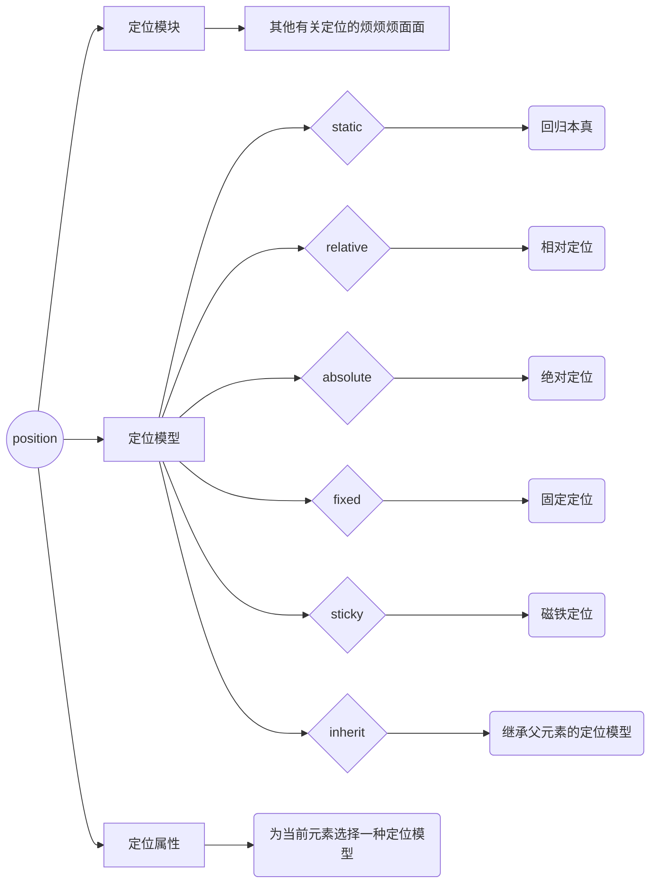

# CSS

### 1. **CSS3新特性**

#### 一、开发商前缀

|   前缀   |        开发商         |
| :------: | :-------------------: |
|  -moz-   |        FireFox        |
| -webkit- | Chrome、Safari、Opera |
|   -ms-   |          IE           |
|   -o-    |    Opera旧版15之前    |


#### 二、静态样式

##### 		2.1 Web字体

```css
@font-face {
    font-family: "pingFangSC-Regular";
    src: url("../font/PingFang Regular_0.ttf");
    font-weight: normal;
    font-style: normal;
}
/// html页面引用   link标签引入； font-family设置
<link rel="stylesheet" href="./css/font.css">
```


##### 		2.2 背景background

###### 				2.2.1 支持多背景

```css
background-image: url("..."), url("...")...
```

###### 				2.2.2 各背景位置

```css
background-position: poisition-1   position-2 ...
```

###### 				2.2.3 各背景的平铺方式

```css
background-repeat: repeat-1,  repeat-2, ...
```

```css
.decorateBox {
    margin: 50px;
    padding: 20px;
    background-image: url("top-left.png"), url("right-bottom.png");
    background-position: left top, right  bottom;
    background-repeat: no-repeat, no-repeat;
}
```


##### 		2.3 渐变

###### 		2.3.1 线性渐变linear-gradient()

```css
background-image: linear-gradient(to direction/angle, color1 [percentage1], color2 [percentage2] ...)

direction: 八个方向， 默认起点在top
angle: 底线为0deg
percentage： 起点
```


###### 		2.3.2 径向渐变radial-gradient()

```css
background-image: radial-gradient([shape size at position], start-color, ..., end-color);
// 参数
shape: 圆的类型
	ellipse: (默认)指定椭圆形的镜像渐变
	circle: 指向圆形的径向渐变

size: 定义渐变的大小
	farthest-corner(默认): 指定径向渐变的半径长度为从圆心到离圆心最远的角
	closest-side: 指定径向渐变的半径长度为从圆心到离圆心最近的边
	closest-corner: 指定径向渐变的半径长度为从圆心到离圆心最近的角
	farthest-side: 指定径向渐变的半径长度为圆心到离圆心最远的边

position: 定义渐变的位置
	1. 位置名词
		center:(默认) 设置中间为径向渐变圆心的纵坐标值。
		top: 设置顶部为径向渐变圆心的纵坐标值
		bottom: 设置底部为径向渐变圆心的纵坐标值
	2. 自定义位置
		percentage1、percentage2
			percentage1： 距离左边的距离
			percentage2： 距离顶部的距离
```

```html
<!DOCTYPE html>
<html>

<head>
    <meta charset="UTF-8">
    <title>线性渐变与径向渐变</title>
    <style type="text/css">
        .box1 {
            width: 100px;
            height: 100px;
            background-image: linear-gradient(to left, red, blue);
            float: left;
        }

        .box2 {
            width: 100px;
            height: 100px;
            background-image: linear-gradient(red, blue);
            float: left;
        }

        .box3 {
            width: 100px;
            height: 100px;
            background-image: linear-gradient(to right bottom, red, blue);
            float: left;
        }

        .box4 {
            width: 100px;
            height: 100px;
            background-image: linear-gradient(60deg, red, blue);
            float: left;
        }

        .box5 {
            width: 100px;
            height: 100px;
            background-image: linear-gradient(red 40%, blue 70%);
            float: left;
        }

        .box6 {
            width: 100px;
            height: 100px;
            background-image: radial-gradient(circle, red 30%, yellow 50%, blue 80%);
            float: left;
        }

        .box7 {
            width: 100px;
            height: 100px;
            background-image: radial-gradient(circle, white, blue);
            float: left;
        }

        .box8 {
            width: 100px;
            height: 100px;
            background-image: repeating-radial-gradient(circle, yellow, green 10%);
            float: left;
        }
    </style>
</head>

<body>
    <div class="box1"></div>
    <div class="box2"></div>
    <div class="box3"></div>
    <div class="box4"></div>
    <div class="box5"></div>
    <div class="box6"></div>
    <div class="box7"></div>
    <div class="box8"></div>
</body>

</html>
```


###### 		2.3.3 循环渐变repeating-radial-gradient（）/ repeating-linear-gradient（）

```tex
/**最重要的是限制渐变的大小（用起点），以使其可以循环**/
background-image: repeating-linear-gradient(to direction/angle, color1 [percentage1], color2 [percentage2], ..., colorn [percentagen])

background-image: repeating-radial-gradient([shape size at position], start-color, ..., last-color);
```

```css
.box8 {
    width: 100px;
    height: 100px;
    backgeound-image: repeating-gradial-gradient(circle, yellow, green 10%);
}
```


##### 		2.4 圆角border-radius

###### 		2.4.1 border-radius: 每个角内切圆半径

```tex
/**
语法：
两个值： 左上右下  右上左下
四个值： 左上 右上 右下 左下
**/
```

```css
/**圆（容器宽和高相同）**/
border-radius: 50%;
```

```css
/**椭圆（容器宽是高的两倍）**/
border-radius: wisth / height;
```

```css
/**上半圆（容器宽是高的两倍）**/
border-radius： height height 0 0 ;
```

```css
/**侧半圆（容器宽是高的两倍）**/
border-radius:width 0 0 width;
```


###### 		2.4.2 border （top/bottom/left/right）- radius : 针对某一个角

```css
/**
语法：
适合用来标识不规则的圆形
两个值： 水平半径  垂直半径
一个值： 水平半径和垂直半径为指定值
**/
```


##### 		2.5 阴影shadow

###### 		2.5.1 text-shadow: 文字阴影

```css
/**语法**/
text-shadow (x,y,blur,color1, x2,y2,blur, color2,....)
	x: 向右移动x个单位
	y: 向下移动y个单位
	blur: 模糊度，单位px，值越大越模糊
	color: 不写阴影颜色默认和字体颜色相同，可以改其值
```


###### 		2.5.2 box-shadow: 盒子阴影

```css
/**语法**/
box-shadow: (x y blur spread color [inset], x2 y2 blur2 spread2 color2 [inset])
	x: 阴影向左移动x个单位
	y: 阴影向下移动y各单位
	blur: 模糊度，值越大越模糊，单位px
	spread:增大模糊边界之前实心颜色面积，值越大，面积越大
	color: 颜色
	inset: 内阴影，不写默认为外阴影，写了outset无效果
```


##### 		2.6 透明度opacity

###### 		2.6.1 方式1： rgba()

```css
rgba(0~255,0~255,0~255,0~1)
```


###### 		2.6.2 方法2： opacity

```css
IE: filter: alpha(opacity="value")

0~100
```

```css
现代浏览器：opacity

0(透明)~ 0.5(半透明) ~ 1(不透明)
```


###### 		2.6.3 区别

```css
方式1： 可以让指定的样式透明，而不影响其他样式
方式2： 占空间，且所有子内容都会透明
```


#### 三、动态样式

##### **3.1 transition过渡**

**3.1.1 transtion-property: 规定设置过渡效果的css属性的名称**

```css
如果要全部属性则用all
```

###### **3.1.2 transition-duration: 规定完成过度动画效果需要的时间**

```css
单位： 秒/毫秒
```

###### **3.1.3 transition-delay: 规定过渡效果延迟时间**

```css
单位： 秒/毫秒
延迟则数值为正，提前则为负
如果是提前的话，当要开始的时候直接变为当前秒数的样式，没有延迟。就是说，如果提前两秒的话，那么当过度开始的时候直接变为两秒的时候应该有的样式。
```

###### **3.1.4 transition-timing-function: 规定速度效果的速度曲线**

```css
linear: 匀速
ease: 默认值，速度逐渐慢下来
ease-in: 加速
ease-out: 减速
cubic-bezier: 先加速后减速
```

```html
<!DOCTYPE html>
<html>

<head>
    <title>过渡动画</title>
    <style>
        div {
            width: 100px;
            height: 100px;
            background-color: red;
            transition-property: all;
            transition-delay: -1s;
            transition-duration: 3s;
            transition-timing-function: ease-in;
            /*复合写法 transition: all 3s -1s ease-in; */
        }
        div:hover {
            width: 200px;
            height: 200px;
            background-color: blue;
        }
    </style>
</head>

<body>
    <div></div>
</body>

</html>
```

###### **3.1.5 符合样式**

```css
transition: 属性  完成时间  延迟时间  速度曲线
	属性和曲线不写就默认all 和 linear
	transition 属性不能添加到hover伪类上
```

###### **3.1.6 常常与transition有联系的样式**

```css
opacity 透明度
shadow  阴影
渐变
transform 变形
```

###### **3.1.7 触发方式**

```css
1、 hover / focus 伪类定义新的样式，移入移出或聚焦造成过渡动画效果
2、 js操作该对象的样式
```

##### **3.2 transform 变换**

###### **3.2.1 translate 位移**

```css
/***语法：***/
translate(valueX, valueY)  x,y方向上都有位移
translate(value)  默认一个值是x方向上的位移
translateX(value)
translateY(value)
translateZ(value)
```

###### **3.2.2 scale 缩放**

```css
/***语法（单位： 比例值）***/
scale(value)  写一个值就是宽高都缩放
scaleX(x) 在x轴缩放x倍， -1的话会左右翻转（镜像翻转）
scaleY(y)
scaleZ(z)
```

###### **3.2.3 rotate旋转**

```css
/***语法：（单位：角度deg）***/
rotate(value deg)  和 rotateZ是相同的效果
roatetX(x deg)  正值沿着x轴向上翻转，负值沿着x轴向左翻转
rotateY(y deg)
rotateZ(z deg)
```

###### **3.2.4 skew 斜切**

```css
/**单位  角度deg**/
skew(value deg)  与skewZ效果相同
skew(x deg, y deg) skewX与skewY 效果都有
skewX(x deg)  水平方向保持不变。垂直方向正值向左倾斜，负值向右倾斜
skewY(y deg)
```

```html
<!DOCTYPE html>
<html>

<head>
    <meta charset="UTF-8">
    <title>位移与缩放</title>
    <style>
        .box1 {
            width: 100px;
            height: 100px;
            background-color: red;
            transform: skew(30deg);
            float: left;
            margin: 60px;
        }

        .box2 {
            width: 100px;
            height: 100px;
            background-color: red;
            transform: skewY(30deg);
            float: left;
            margin: 50px;
        }

        .box3 {
            width: 100px;
            height: 100px;
            background-color: red;
            float: left;
            margin: 50px;
        }

        .box4 {
            width: 100px;
            height: 100px;
            background-color: red;
            float: left;
            transform: translate(100px) skew(45deg);
        }
    </style>
</head>

<body>
    <div class="box1"></div>
    <div class="box2"></div>
    <div class="box3"></div>
    <div class="box4"></div>
</body>

</html>
```

###### **3.2.5 transform-origin: 基点的位置（变形的基准位置）**

```css
transition-origin: x y [z 3D的时候才需要设置z]
```

###### **3.2.6 变形操作只能添加给块元素，但是不能添加给行内元素**

```css
行内元素设置width和height无效，变形操作的底层逻辑是操作的都是对象的宽和高
```

###### **3.2.7 符合写法**

```css
符合写法： 可以同时添加多个操作对象
例： transform: translate(100px )  skew(45deg)  scale(2)  rotate(90deg)
```

###### **3.2.8 执行顺序(后写的先执行)**

```css
先写的translate不会收到后面的变形操作的影响
后写的translate()会收到先写的rotate、scale、skew的影响
	translate() 会位移（位移  缩放） 的长度
	translate() 会在rotate的角度的方向位移相应的长度，再进行旋转
	translate() 会在skew的角度的方向位移相应的长度，在进行斜切
```

##### **3.3 animation 动画**

###### **3.3.1 animation-name**

```css
设置动画的名字（自定义的名字）
```

###### **3.3.2 animation-duration** 

```css
动画的持续时间
```

###### **3.3.3 animation-delay** 

```css
动画的延迟时间
```

###### **3.3.4 animation-iteration-count**

```css
动画的重复次数，默认值就是1，单位是数值，infinite无限次数
```

###### **3.3.5 animation-timing-function**

```css
/***动画的运动方式***/
linear: 匀速
ease: 默认值，速度逐渐慢下来
ease-in: 加速
ease-out: 减速
cubic-bezier: 先加速后减速
```

###### **3.3.6 animation-fill-mode**

```css
规定动画播放的之前或之后，期动画效果是否可见
none: (默认值) 在运动结束后回到初始位置，在延迟的情况下，让0%在延迟后生效
backwards： 在延迟的情况下，让0%在延迟前生效
forwards: 在运动结束后，停在技术位置
both： backwards 和 forwards同时生效

注： 运动结束后，默认停在初始位置
```

###### **3.3.7 animation-direction**

```css
属性定义是否应该轮流反向播放动画
alternate： 一次正向（0%~100%）, 一次反向(100% - 0%)
reverse: 永远都是反向，从100% - 0%
normal: （默认值） 永远都是正向的，从0% - 100%
```

###### **3.3.8 复合写法**

```css
animation: name duration delay count function mode direction
```

###### **3.3.9 keyframe 定义动画过程**

```css
animation 定义在元素内，动画过程要写在@keyframe内
```

###### **3.3.10 引入animate.css**

```css
工具animate.css,引入各种动画样式

```


#### 四、布局

##### **4.1 分栏布局**

###### **4.1.1 column-count**

```css
分栏的个数
```

###### **4.1.2 column-width**

```css
分栏的宽度
```

###### **4.1.3 column-gap**

```css
分栏的间距
```

###### **4.1.4 column-rule**

```css
分栏的边线  和边框语法一样
```

###### **4.1.5 column-span**

```css
合并分栏的个数    全部则为all
```

###### **4.1.6 em才是首选单位**

```html
<!DOCTYPE html>
<html>

<head>
    <title>column布局</title>
    <style type="text/css">
        .box1 {
            width: 800px;
            height: 400px;
            border: 1px black solid;
            margin: 30px auto;
            column-count: 4;
            column-width: 100px;
            column-rule: 1px solid gray;
            column-gap: 20px;
        }

        .box1 h2 {
            column-span: all;
            text-align: center;
        }
    </style>
</head>

<body>
    <div class="box1">
        <h2>CSDN标题</h2>
        <p>中国专业IT社区CSDN (Chinese Software Developer Network) 创立于1999年，致力于为中国软件开发者提供知识传播、在线学习、职业发展等全生命周期服务。</p>
        <p>旗下拥有：专业的中文IT技术社区： CSDN.NET；移动端开发者专属APP： CSDN
            APP、CSDN学院APP；新媒体矩阵微信公众号：CSDN资讯、程序人生、GitChat、CSDN学院、AI科技大本营、区块链大本营、CSDN云计算、GitChat精品课、人工智能头条、CSDN企业招聘.. </p>
        <p>涵盖CSDN资讯、AI科技大本营、区块链大本营、GitChat、GitChat精品课、程序人生、人工智能头条、Python大本营、CSDN学院等，覆盖各个专业技术领域，为IT开发者和从业人员提供资讯、学习、交流、互动和分享平台。
        </p>
        <p>CSDN学院是CSDN旗下的在线</p>
    </div>
</body>

</html>
```

##### **4.2 移动端之百分比布局/流式布局**

###### **4.2.1 应用场景： 应对窗口大小缩放的方案**

###### **4.2.2 特点： 高度固定，宽度自适应（百分比）**

###### **4.2.3 设计细节**

```css
对于大的轮播图等，宽度100%自适应
对于小图标或者文本，一般都是固定宽高大小
对于大屏幕来说，有些布局元素会显得很长。这时候需要将外边距固定
先写固定布局，在创建流式布局
```

###### **4.2.4 流式图片**

```css
宽度限定为容器的最大宽度，max-width： 100%
如果要有外边距：则样式应该是
	box-sizing: border-box
	margin: 单位百分比
```

###### **4.2.5 流式排版**

```css
<!DOCTYPE html>
<html>

<head>
    <meta charset="UTF-8">
    <title></title>
    <style>
        * {
            margin: 0;
            padding: 0;
        }

        .leftColumn {
            width: 33.3%;
            float: left;
            background-color: yellow;
            height: 300px;
        }

        .rightColumn {
            width: 66.7%;
            height: 300px;
            background-color: #7FFF9B;
            float: left;
        }

        .container {
            width: 90%;
            height: 300px;
            margin: 0 5%;
        }
    </style>
</head>

<body>
    <div class="container">
        <div class="leftColumn">left</div>
        <div class="rightColumn">right</div>
    </div>
</body>

</html>
```

##### **4.2 响应式布局**

###### **4.2.1 同一套页面可以兼容不同分辨率的设备**

###### **4.2.2 设计原则**

```css
页面元素宽度不用px作为单位，而是尽量使用百分比。
页面框架之间使用流式布局，也就是使用float属性，这样当元素超出屏幕宽度的时候会滑到下面而不是撑出水平滚动条。
注意图片的大小，尤其是宽度，同样尽量使用百分比。
先做好PC端的样式，然后使用css中的@media媒体查询来适配不同的终端。将页面栅格化。
```

###### **4.2.3 媒体查询**

```css
媒体类型：
all: 用于所有的设备
print： 用于打印机和打印预览
screen: 用于电脑屏幕
speech: 应用于屏幕阅读器等发生设备
```

```css
媒体特性：
and： 和
not： 非
min-width： 最小宽度，用于给桌面浏览器调整窗口
max-width： 最大宽度，用于给桌面浏览器调整窗口，常用
min-device-width: 设备最小宽度，适应不同移动浏览器视口大小
max-device-width: 设备最大宽度，适应不同移动浏览器视口大小,常用
orientation: 竖屏还是横屏，常用
	portrait：竖屏
	landscape: 横屏
<link>: link标签满足某条件才生效
```

###### **4.2.4 防止样式非意外叠加（边界值问题）**

```css
@media (not max-width: 600px) and (max-width:700px);
// 在（600，700] px之间（方法1）

@media (max-width: 600px) and (max-width: 699.99px)
// 在600-699.99px之间（方法2）
```

###### **4.2.5 替换整个样式表**

```css
当样式修改不多时仅仅用@media执行即可
修改样式较多时需要创建一个新的样式表便于管理，link标签中使用media属性查询
```

```html
<link rel="stylesheet" media="screen and (max-device-width:480px)" href="iphone.css"/>
```

###### **4.2.6 识别特定设备**

```css
/***像素比（物理像素除以css像素）-webkit-min-device-pixel-ratio  **/

-webkit-min-device-pixel-ratio 为1.0：
	1. 所有非Retina的mac
	2. 所有非Retina的IOS设备
	3. Acer Iconia A500
	4. Samsung Galaxy Tab 10.1
	5. Samsung Galaxy S

-webkit-min-device-pixel-ratio为1.3：
	1. Google Nexus 7

-webkit-min-device-pixel-ratio为1.5：
	1.Google Nexus S
	2.Samsung Galaxy S II
	3.HTC Desire
	4.HTC Desire HD
	5.HTC Incredible S
	6.HTC Velocity
	7.HTC Sensation

-webkit-min-device-pixel-ratio为2.0：
	1.iPhone 4
	2.iPhone 4S
	3.iPhone 5
	4.iPad (3rd generation)
	5.iPad 4
	6.所有Retina displays 的MAC
	7.Google Galaxy Nexus
	8.Google Nexus 4
	9.Google Nexus 10
	10.Samsung Galaxy S III
	11.Samsung Galaxy Note II
	12.Sony Xperia S
	13.HTC One X  
```

```css
@media screen and ( min-width: 212px){/*213px显示屏样式 LG Optimus One*/}
@media screen and ( min-width: 319px){/*320px显示屏样式 苹果4/4S/5C/5S黑莓Z30 */}
@media screen and ( min-width: 359px){/*360px显示屏样式 索尼Z1*/}
@media screen and ( min-width: 383px){/*384px显示屏样式 黑莓Z10 谷歌 Nexus 6 LG Optimus G*/}
@media screen and ( min-width: 399px){/*399px显示屏样式 三星galaxyNote*/}
@media screen and ( min-width: 414px){/*414px显示屏样式 苹果6plus*/}
@media screen and ( min-width: 423px){/*424px显示屏样式 LG 4X */}
@media screen and ( min-width: 479px){/*480px显示屏样式 索尼MT27i Xperia sola*/}
@media screen and ( min-width: 539px){/*640px显示屏样式 摩托罗拉Droid3/4/Razr Atrix 4g*/}
@media screen and ( min-width: 639px){/*640px显示屏样式*/}
@media screen and ( min-width: 640px){/*640px以上显示屏样式*/}
```


### 2.  **清除浮动的几种方法**

```css
清除浮动主要是为了解决，父元素因为子元素浮动引起的内部高度为0的问题
```

```html
给父元素设置一个border，内部放两个盒子一个samll 另一个big，位给big和small设置浮动，则他们的会默认撑开父元素
<!DOCTYPE html>
<html>
<head>
    <meta charset="UTF-8">
    <title></title>
    <style type="text/css">
        .container {
            border: 1px solid red;
        }
        .small {
            width: 60px;
            height: 60px;
            background-color: blue;
            // float: left
        }
        .large {
            width: 120px;
            height: 120px;
            background-color: burlywood;
            // float: left
        }
    </style>
</head>
<body>
    <div class="container">
        <div class="small">small</div>
        <div class="large">large</div>
    </div>
</body>
</html>
```

```css
当给内部两个元素（small和large）盒子增加上float属性的时候，下面的盒子会顶上来，然后父元素因为没有设置高度，变成了一条线，big和large已经浮动了。
```

```css
总结一下：
当父元素不给高度的时候， 内部元素不浮动时会撑开， 而浮动的时候，父元素会变成一条线
```

> clear: both 本质上是闭合浮动，就是让父元素闭合出口和入口，不让盒子出来

#### **2.1 额外标签法（在最后一个浮动标签后，新加一个标签，给其设置clear:both）(不推荐)**

```html
<!DOCTYPE html>
<html>
<head>
    <meta charset="UTF-8">
    <title></title>
    <style type="text/css">
        .container {
            border: 1px solid red;
        }
        .small {
            width: 60px;
            height: 60px;
            background-color: blue;
            float: left;
        }
        .large {
            width: 120px;
            height: 120px;
            background-color: burlywood;
            float: left;
        }
        .clear {
            clear: both;
        }
    </style>
</head>
<body>
    <div class="container">
        <div class="small">small</div>
        <div class="large">large</div>
        <div class="clear">额外标签法</div>
    </div>
</body>
</html>
```

> 如果我们清除了浮动，父元素自动检测子盒子最高的高度，然后与其同高。
>
> 优点： 通俗易懂，方便
>
> 缺点： 添加无意义的标签，语义化较差  （不建议使用）

#### **2.2 父元素增加overflow属性（父元素添加overflow：hidden）（不推荐）**

```css
通过BFC方式，实现清除浮动
.container {
    overflow: hidden;
}
```

> 优点：代码简洁
>
> 缺点：内容增多的时候容易造成不会自动换行导致内容被隐藏，无法显示要溢出的元素。 （不推荐使用）

#### **2.3 使用after伪元素清除浮动（推荐使用）**

```html
.clearfix::after { /**伪元素是行内元素，正常浏览器清除浮动的方法**/
	content: "";
	display: block;
	height: 0;
	clear: both;
	visibility: hidden;
}
.clearfix {
	*zoom: 1; /***ie6清除浮动的方法 * 号只有IE6-IE7执行，其他浏览器不执行 ***/
}
<body>
    <div class="father clearfix">
        <div class="big">big</div>
        <div class="small">small</div>
    </div>
    <div class="footer"></div>
</body>
```

>优点：符合闭合浮动思想，结构语义化正确
>
>缺点： ie6-ie7不支持伪元素，使用zoom：1触发hasLayout。。。 推荐使用

#### **2.4 使用before和after双伪元素清除浮动**

```html
.clearfix:before,.clearfix::after {
	content: "";
	display: table;
}
.clearfix:after{
	clear: both;
}
.clearfix {
	*zoom: 1;
}
<div class="father clearfix">
   <div class="big">big</div>
   <div class="small">small</div>
</div>
<div class="footer"></div>
```

>优点： 代码更加简洁
>
>缺点：用zoom：1 触发hasLayout

### 3. **盒子模型**

#### **3.1 盒子模型种类**

- **分别是ie盒子模型和标准W3C 盒子模型**
- 两种模型对height和width的计算方式不同，可以通过CSS属性box-sizing来对这两种标准进行切换，当值为content-box时为标准盒子模型，值为border-box时为IE盒子模型。

```css
盒子边框
border： border-width | border-style | border-color
```

```css
圆角
border-radius: 左上角  右上角 右下角 左下角
```

```css
内边距（padding）

```

```css
外边距（margin）
盒子居中
1. 必须是块级元素 2. 左右边距 都设置为auto （margin：100px auto）
```

```css
margin 塌陷问题
在标准文档流中，竖直方向的margin会出现叠加的现象（水平方向不会塌陷），两个margin紧挨着，中间没有border或者padding   Margin直接解除就产生了合并。
表现为较大的margin会覆盖掉较小的margin，竖直方向的两个盒子之间只有一个较大的margin，这就是margin塌陷现象。
```

- 给父元素添加透明的边框，至少添加上border-top:1px solid transparent;
- 给父元素添加padding-top：1px
- 给父元素添加overflow： hidden
- 给父元素添加position: absolute
- 给父元素添加position: fixed;
- 给父元素添加display: inline-block

当margin、padding、border都为0时，两种盒子模型没有区别。

### 4. **Flex布局**

布局的传统解决方案，基于盒状模型，依赖`display` 属性 + `position`属性+ `float`属性。他对于那些特殊布局非常不方便，比如：垂直居中就不容易实现。

#### **4.1 Flex 布局是什么？**

flex布局，意味“弹性布局”，用来为盒状模型提供最大的灵活性。

任何一个容器都能指定为flex布局

```css
.box {
    display: flex;
}
```

行内元素也可以使用flex布局

```css
.box {
    display: inline-flex;
}
```

注意：设置为flex布局后，子元素的`float`、`clear`和`vertical-align`属性将失效。

#### **4.2 基本概念**

采用flex布局的元素，成为flex容器。他的所有子元素自动成为容器里的成员，成为flex项目。

容器默认存在两根轴：水平的主轴和垂直的交叉轴。主轴的开始位置（与边框的交叉点）叫做`main start`，结束的位置叫做`main end`; 交叉轴开始的位置叫做`cross start`，结束位置叫做`cross end`。

项目默认沿主轴排列。单个项目占据的主轴空间叫做`main size`，占据的交叉轴空间叫做`cross size`。

#### **4.3 容器的属性**

以下6个属性设置在容器上。

```css
flex-direction
flex-wrap
flex-flow
justify-content
align-items
align-content
```

##### **4.3.1 flex-direction 属性**

`flex-direction`属性决定主轴的方向（即项目的排列方向）

```css
.box {
    flex-direction: row | row-reverse | column | column-reverse;
}
row: (默认值) 主轴为水平方向，起点在左端
row-reverse： 起点在右端
column： 主轴为垂直方向，起点在上沿
column-reverse: 起点在下沿
```

##### **4.3.2 flex-wrap 属性**

默认情况下，项目都排在一条线上（又称 轴线）。`flex-wrap`属性定义，如果一条轴线排不下，如何换行。

```css
.box {
    flex-wrap: nowrap | wrap | wrap-reverse;
}
1. nowrap: 默认  不换行
2. wrap： 换行，第一行在上方
3. wrap-reverse： 换行，第一行在下方
```

##### **4.3.3 flex-flow**

`flex-flow`属性是`flex-direction`属性和`flex-wrap`属性的简写形式，默认值为`row nowrap`;

```css
.box {
    flex-flow: < flex-direction> || <flex-wrap>
}
```

##### **4.3.4 justify-content属性**

`justify-content`属性定义了项目在主轴上的对齐方式。

```css
.box {
    justify-content: flex-start | flex-end | center | space-between | space-around | space-evenly;
}
```

```css
flex-start: (默认值) 左对齐
flex-end: 右对齐
center: 居中
space-between: 两端对齐，项目之间的间隔都相等。
space-around: 每个项目两侧的间距相等。项目之间的间距比项目与边框的间隔大一倍
space-evenly: 间距相等
```

##### **4.3.5 align-items 属性**

`align-items` 属性定义项目在交叉轴上如何对齐。

```css
.box {
    align-items: flex-start | flex-end | center | baseline | stretch;
}
```

```css
stretch: (默认值) 如果项目未设置高度或者设为auto，将占满整个容器的高度。
flex-start： 交叉轴的起点对齐
flex-end: 交叉轴的终点对齐
center: 交叉轴的中点对齐
baseline: 项目的第一行文字的基线对齐
```

##### **4.3.6 align-content 属性**

`align-content`属性定义了多跟轴线的对齐方式。如果项目只有一根轴线，该属性不起作用。

```css
.box {
    align-content: flex-start | flex-end | center | space-between | space-around | stretch ;
}
```

```css
flex-start: 与交叉轴的起点对齐
flex-end: 与交叉轴的终点对齐
center: 与交叉轴的中点对齐
space-between: 与交叉轴两端对齐，轴线之间的间隔平均分布
space-around: 每根轴线两侧的间隔都相等。所以，轴线之间的间隔比轴线与边框的间隔大一倍
stretch: (默认值) 轴线占满整个交叉轴
```

#### **4.4 项目的属性**

以下6个属性设置在项目上。

```css
order: 
flex-grow:
flex-shrink:
flexbasis:
flex:
align-self:
```

##### **4.4.1 order属性**

`order`属性定义项目的排列顺序。数值越小，排列越靠前，默认值为0.

```css
.item {
    order: <integer>;
}
```

##### **4.4.2 flex-grow 属性**

`flex-grow` 属性定义项目放大的比例，默认值为0，即如果存在剩余空间，也不放大。

```css
.item {flex-grow: <integer>}
```

如果所有项目的`flex-grow`属性都为1，则他们将等分剩余空间（如果有的话）。如果一个项目的`flex-grow`属性为2，其他项目都为1，则前者占据的剩余空间将比其他项目多一倍。

##### **4.4.3 flex-shrink属性**

`flex-shrink`属性定义了项目的缩小比例，默认为1，即如果空间不足，该项目将缩小。

```css
.item {
    flex-shrink: <number>
}
```

如果所有项目的`flex-shrink`属性都为1，当空间不足时，都将等比例缩小。如果一个项目的`flex-shrink`属性为0，掐项目都为1，则空间不足时，前者不缩小。

负值对该属性无效。

##### **4.4.4 flex-basis 属性**

`flex-basis`属性定义了在分配多余空间之前，项目占据的主轴空间。 浏览器根据这个属性，计算主轴是否有多余空间。他的默认值是`auto`，即项目的本来大小。

```css
.item {
    flex-basis: <length> | auto;  /**默认值  auto**/
}
```

他可以设为跟`width`或`height`属性一样的值（比如350px）,则项目将占据固定空间。

##### **4.4.5 flex属性**

`flex`属性是`flex-grow` `flex-shrink` `flex-basis`的简写，默认值是`0 1 auto`。 后两个属性可选。

```css
.item {
    flex: none | [<flex-grow> <flex-shrink> ?|| <flex-basis>]
}
```

该属性有两个快捷值： `auto`、(`1 1 auto`)和none （`0 0 auto`）.

建议优先使用这个属性，而不是单独写三个分离的属性，因为浏览器会推算相关值。

##### **4.4.6 align-self 属性**

`align-self`属性允许单个项目有与其他项目不一样的对齐方式，可覆盖`align-items`属性。默认值为`auto`，表示继承父元素的`align-items`属性，如果没有父属性，则等同于`stretch`。

```css
.item {
    align-self: auto | flex-start | flex-end | center | baseline | stretch
}
```


### 5. **BFC原理**

#### **5.1 BFC定义**

```css
BFC(块级格式化上下文)。他是一个独立的渲染区域，只有block-level  box参与，它规定了内部的block-level box如何布局，并且这个区域和外部毫不相干。
```

**Box：css布局的基本单位**

Box是CSS布局的对象和基本单位。直观来说，就是一个页面是有很多个Box组成的。元素的类型和display属性，决定了这个box的类型。不同类型的box，会参与不同的Formating Context（一个决定如何渲染文档的容器），因此box内的元素会以不同的方式进行渲染。

- block-level box: display 属性为block、lis-item、table的元素，会生成block-level box 。并且参与到block formatiing context。
- inlin-lebel box：display 属性为inline、inline-block、inline-table的元素，会生成inline-level box。并且参与到inline formatting context
- run-in box：css3中才有

**Formatting Context**

Formatting  Context是w3c规范中的一个概念。他是页面中的一块渲染区域，并且有一套渲染规则，它决定了其子元素将如何定位，以及和其它元素的关系和相互作用。

```css
BFC是一个独立的布局环境，其中的元素布局是不受外界的影响，并且在一个BFC中，块盒和行盒（行盒有一行中所有的内联元素组成）都会垂直的沿着其父元素的边框排列。
```

##### **BFC的布局规则**

1. 内部的BOX会在垂直方向，一个接一个的放置。
2. box垂直方向的距离由margin决定。属于同一个BFC的两个相邻box的margin会发生重叠。
3. 每个盒子（行快和块盒）的margin box的左边，与包含块border box的左边想接触（对于从左到右的格式化，否则相反）。即使存在浮动也是如此。
4. BFC的区域不会与float  box重叠
5. BFC就是页面上的一个隔离的独立容器，容器里面的子元素不会影响到外面的元素。
6. 计算BFC的高度时，浮动元素也参与计算。

##### **如何创建BFC**

1. float值不是none
2. position值不是static或者relative
3. display的值是inline-block、table-cell、flex、table-caption或者inline-flex
4. overflow的值不是visible

##### **BFC的作用**

1. 利用BFC避免margin重叠
2. 自适应两栏布局
3. 清除浮动

```css
BFC就是页面上的一个隔离的独立容器，容器里面的子元素不会影响到外面的元素。反之也是如此。
```

### 6. **position定位**



1. position之static

   默认值。没有定位，元素出现在正常流中。

2. position之relative

   生成相对定位的元素，通过top、bottom、left、right的设置相对于其正常（原先本身）位置进行定位。可以通过z-index进行层次分层。 

3.  

4.  

5.  

6.  

7.  

8. 


### 7. **水平垂直居中的几种方式**


### 8. **CSS优先级权重**


### 9. **transition / animation 区别**


### 10. **border: none 和 border:0 的区别**


### 11. **diaplay: none / visibility   hidden / opacity:0 的区别**


